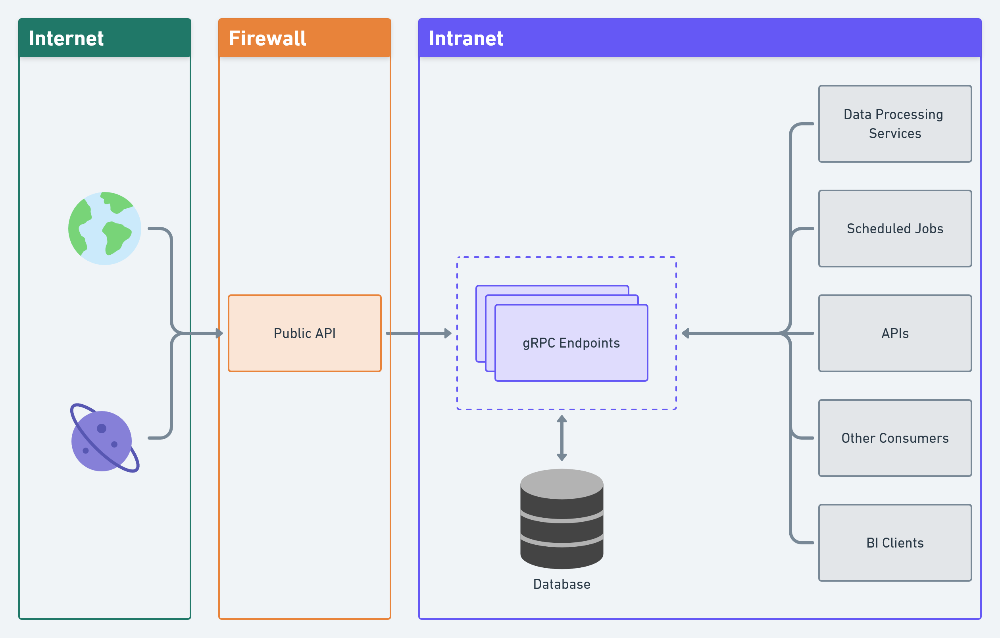

# Environment Sensor Data Processor
I’m used to working in projects where the system receives tons of data (readings) from various environment sensors and 
then decide to act, depending on what it is receiving.

Since I have never worked with gRPC and ZODB with Python, I decided to create this project.
The idea is simple: Use gRPC and ZODB and create a base system that could digest lots of sensor data and scale out,
if necessary.

Some aspects of this project (like validation and what to do with the readings received) are quite generic,
since it’s not based on any business logic or real world case.

# Entities
In its current state, this project has 3 entities:
1. **Location**: Not all that useful. Not used for anything, really. Included because it makes sense, even in a basic setting for this type of thing.
2. **Sensor**: Represents the physical sensor that's (hypothetically) sending environment readings.
3. **Sensor Reading**: The actual reading from the sensor. Contains a lot of data.

The current version of `Sensor Reading` contains both the id of its sensor and the id of its location. Normally, the 
reading would not have both, but I decided to include it so I could make a few more validations on each reading.

Also, all entities have read-only properties and validation on setters, to make sure everything is has it should be.

# How to make it all work
You use the current scripts:
1. `run_server.py`: starts the gRPC server
2. `run_client.py`: sends random readings to the server and then fetches (and prints) all readings
3. _add flask start script_

# Big picture
- Clients, services, private apis and other clients can access teh gRPC endpoints.
- Meanwhile, a public API can be used (by a frontend or other third party applications), to make use of gRPC`s endpoint.  

# TODO
0. Lots of refactoring...
1. Create flask interface
2. Convert single use scripts to a commandline interface
3. Add unit tests
4. Add stress tests

# Next steps
After finishing TODO items 1 and 2, I'll probably go look for a raspberry pi zero w and a couple of sensors, so I 
can start "Audrey II" project.